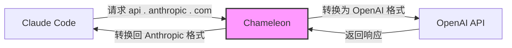
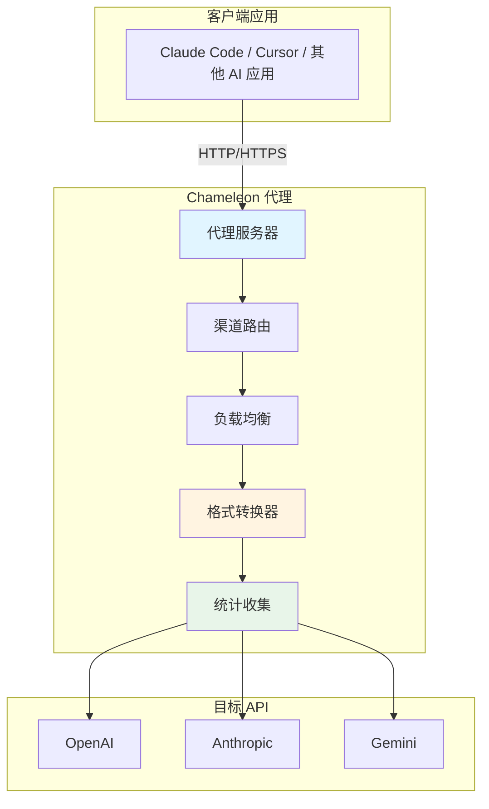
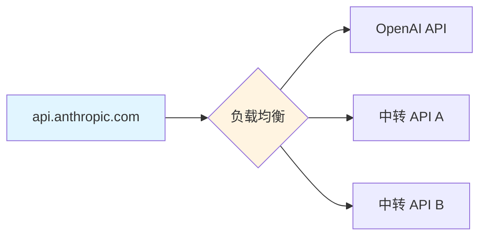
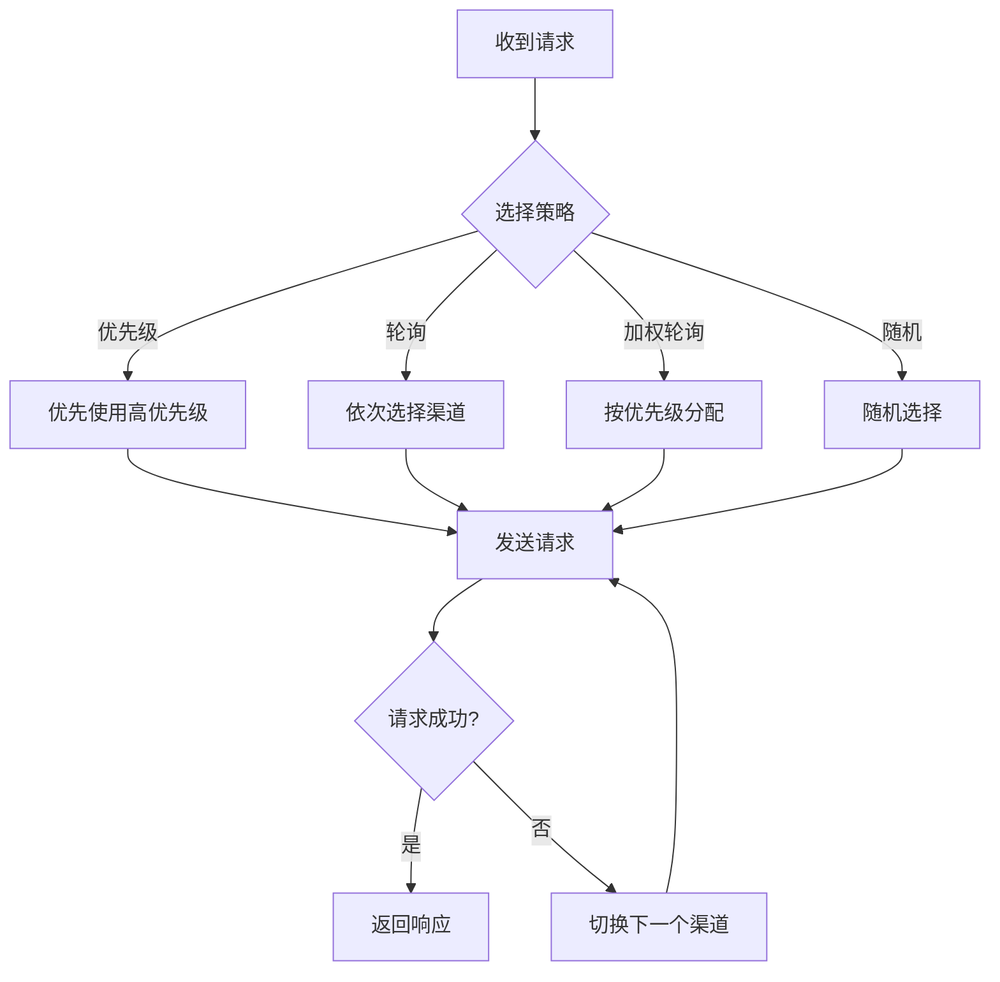

<div align="center">

# Chameleon


基于 Golang + Wails 实现的本地大模型 API 路由代理工具

[](https://golang.org/)
[](https://wails.io/)
[](https://vuejs.org/)
[](LICENSE)
</div>

## 📸 应用截图

<details>
<summary>点击这里查看应用截图</summary>

  
  
  
  
  
  
  

</details>

## 📖 项目简介

Chameleon（变色龙）是一个功能强大的 LLM API 代理工具，可以实现 API 地址替换、参数修改、格式转换等功能。通过简洁优雅的桌面界面，为用户提供多种
AI 服务供应商的统一代理管理体验。

### 核心特性

- 🔄 **智能格式转换** - 支持 Anthropic ↔ OpenAI、Anthropic ↔ Gemini 等多种 API 格式互转
- 🎯 **灵活路由策略** - 轮询、加权轮询、优先级、随机等多种负载均衡
- 🔐 **双模式代理** - HTTP 代理模式 + Host 劫持模式
- 📊 **实时统计** - Token 用量、请求统计、成功率分析
- 🎨 **主题系统** - 35+ 内置主题，简洁大气的界面设计

## 🎯 使用场景

假设你使用 Claude Code，但没有 Anthropic 官方订阅，只有 OpenAI 的 API Key：



Chameleon 会自动：

1. 拦截 Claude Code 发往 `api.anthropic.com` 的请求
2. 将 Anthropic 格式转换为 OpenAI 格式
3. 转发到 OpenAI API 并获取响应
4. 将 OpenAI 响应转换回 Anthropic 格式
5. 返回给 Claude Code

## 🏗️ 系统架构



### 项目结构

```
Chameleon/
├── backend/                 # Go 后端
│   ├── application/        # 主应用逻辑
│   ├── certificate/        # HTTPS 证书管理
│   ├── channel/            # 渠道管理和负载均衡
│   ├── config/             # 配置管理
│   ├── convert/            # 格式转换器
│   ├── host/               # Host 劫持
│   ├── server/             # HTTP 服务器
│   ├── statistics/         # 统计分析
│   └── tray/               # 系统托盘
├── frontend/               # Vue 前端
│   └── src/
│       ├── components/     # UI 组件
│       │   ├── channel/   # 渠道管理
│       │   ├── home/      # 主页
│       │   ├── settings/  # 设置
│       │   └── stats/     # 统计
│       └── App.vue         # 主应用
├── build/                  # 构建资源
└── main.go                 # 应用入口
```

## 🚀 快速开始

### 环境要求

- Go 1.24+
- Node.js 18+
- Wails CLI v2.11+

### 安装步骤

1. **克隆项目**

```bash
git clone https://github.com/sbgayhub/chameleon.git
cd chameleon
```

2. **安装依赖**

```bash
# 安装 Go 依赖
go mod download

# 安装前端依赖
cd frontend
npm install
cd ..
```

3. **开发模式运行**

```bash
wails dev
```

4. **构建生产版本**

```bash
wails build
```

构建完成后，可执行文件位于 `build/bin/` 目录。

## 📚 使用指南

### 1. 选择代理模式

#### HTTP 代理模式

- 启动 HTTP 代理服务器（默认端口 9527）
- 在应用中配置代理地址 `http://127.0.0.1:9527`
- 适合支持代理设置的应用

#### Host 劫持模式

- 自动修改系统 hosts 文件，劫持目标域名到 127.0.0.1
- 监听 443 端口，无需应用配置
- 适合不支持代理设置的应用

### 2. 配置渠道组

渠道组代表一个源 API 端点（如 `api.anthropic.com`）对应的多个目标地址：



**配置项：**

- **端点地址** - 需要代理的 API 地址（如 `api.anthropic.com`）
- **供应商类型** - API 格式类型（anthropic/openai/gemini）
- **负载均衡策略** - 轮询/加权轮询/优先级/随机
- **渠道列表** - 多个目标 API 配置

### 3. 添加渠道

每个渠道包含：

- **名称** - 渠道标识
- **目标地址** - 实际请求的 API 地址
- **API Key** - 目标 API 的密钥
- **供应商类型** - 目标 API 格式（anthropic/openai/gemini）
- **模型映射** - 模型名称转换规则
- **优先级** - 用于负载均衡

#### 模型映射规则

支持三种匹配模式：

```yaml
# 精确匹配（优先级最高）
"gpt-4" = "claude-3-5-sonnet-20241022"

# 通配符匹配
"gpt-3.5-*" = "claude-3-haiku-20240307"

# 全通配符（优先级最低）
"*" = "claude-3-5-sonnet-20241022"
```

匹配顺序：精确匹配 → 通配符匹配 → 全通配符 → 保持原模型名

### 4. 启动代理

点击"启动代理"按钮，Chameleon 将：

- 启动代理服务器
- 应用 hosts 配置（Host 劫持模式）
- 开始拦截和转发请求

## 🎨 功能特性

### 智能负载均衡



### 格式转换器

支持以下转换（其他转换器正在开发）：

| 源格式       | 目标格式      | 转换器名称                |
|-----------|-----------|----------------------|
| Anthropic | OpenAI    | anthropic->openai    |
| Anthropic | Anthropic | anthropic->anthropic |
| OpenAI    | Anthropic | openai->anthropic    |
| OpenAI    | OpenAI    | openai->openai       |

转换器自动处理：

- 请求格式转换（消息结构、参数映射）
- 响应格式转换（流式/非流式）
- 模型名称映射
- Token 统计

### 实时统计

- **Token 用量** - 输入/输出 Token 统计
- **请求统计** - 成功/失败次数、成功率
- **渠道详情** - 每个渠道的详细统计
- **数据持久化** - 统计数据自动保存到本地

## 🔧 配置文件

### 主配置文件 (`data/config.toml`)

```toml
[general]
auto_start = false          # 开机自动启动
start_minimized = false     # 最小化启动
close_action = "ask"        # 关闭动作: ask/minimize/exit

[ui]
language = "zh-CN"          # 语言
theme = "light"             # 主题
width = 1200                # 窗口宽度
height = 800                # 窗口高度

[proxy]
mode = "http"               # 代理模式: http/host
port = 9527                 # 监听端口（http 模式）
cert_installed = false      # CA 证书安装状态

[log]
level = "debug"             # 日志级别: debug/info/warn/error
file = true                 # 保存到文件
console = true              # 输出到控制台
```

### 渠道配置 (`data/channels.json`)

```json
{
  "api.anthropic.com": {
    "endpoint": "api.anthropic.com",
    "enabled": true,
    "priority": 0,
    "lb_strategy": 1,
    "provider": "anthropic",
    "channels": {
      "OpenAI": {
        "name": "OpenAI",
        "enabled": true,
        "priority": 10,
        "url": "https://api.openai.com",
        "api_key": "sk-xxx",
        "provider": "openai",
        "model_mapping": {
          "*": "gpt-4"
        },
        "status": 1
      }
    }
  }
}
```

## 🛠️ 技术栈

| 类别      | 技术                       |
|---------|--------------------------|
| 后端语言    | Go 1.24                  |
| 桌面框架    | Wails v2.11              |
| Web 服务器 | net/http + http.ServeMux |
| 前端框架    | Vue 3 + TypeScript       |
| UI 框架   | DaisyUI (Tailwind CSS)   |
| 构建工具    | Vite                     |
| 日志系统    | slog + console-slog      |
| 配置格式    | TOML + JSON              |
| 数据存储    | 内存 + JSON 持久化            |


## 🔒 安全性

- **本地运行** - 所有数据存储在本地，不上传云端
- **证书管理** - 自动生成自签名证书，仅用于本地劫持
- **权限最小化** - 仅在必要时请求管理员权限

## 🤝 贡献指南

欢迎提交 Issue 和 Pull Request！

### 开发规范

- Go 代码使用 `any` 替代 `interface{}`
- 直接使用 `slog`，不创建额外 logger
- 添加必要的中文注释
- 遵守 `gofmt` 格式化规范

### 提交规范

```bash
# 功能开发
git commit -m "feat: 添加 XXX 功能"

# Bug 修复
git commit -m "fix: 修复 XXX 问题"

# 文档更新
git commit -m "docs: 更新 XXX 文档"
```

## 📄 许可证

本项目采用 MIT 许可证 - 详见 [LICENSE](LICENSE) 文件

## 🙏 致谢

- [Wails](https://wails.io/) - 优秀的 Go 桌面应用框架
- [DaisyUI](https://daisyui.com/) - 简洁优雅的 UI 组件库
- [Vue.js](https://vuejs.org/) - 渐进式 JavaScript 框架

## 📮 联系方式

- **Issues**: [GitHub Issues](https://github.com/sbgayhub/chameleon/issues)
- **Discussions**: [GitHub Discussions](https://github.com/sbgayhub/chameleon/discussions)

---

<div align="center">

**如果这个项目对你有帮助，请给一个 ⭐️ Star！**

Made with ❤️ by Chameleon Team

</div>
