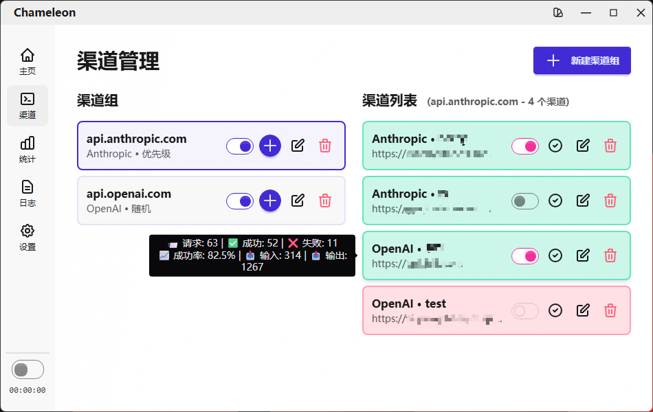
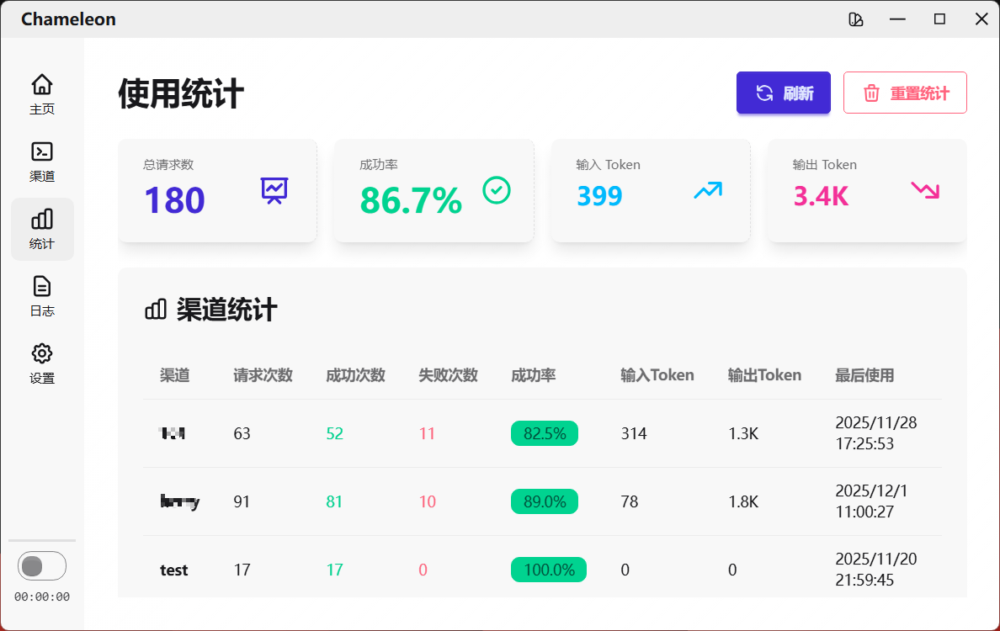
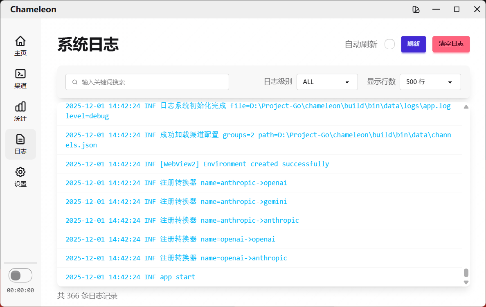
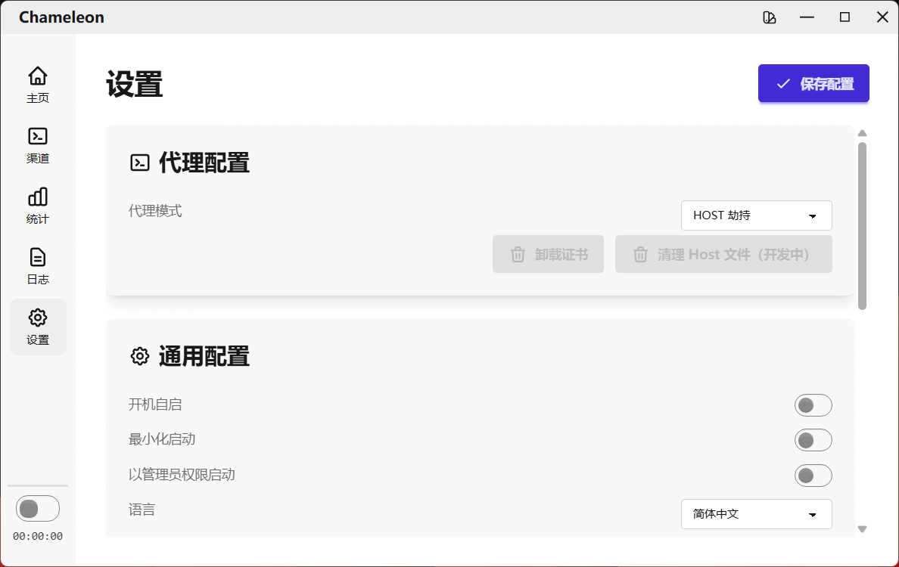
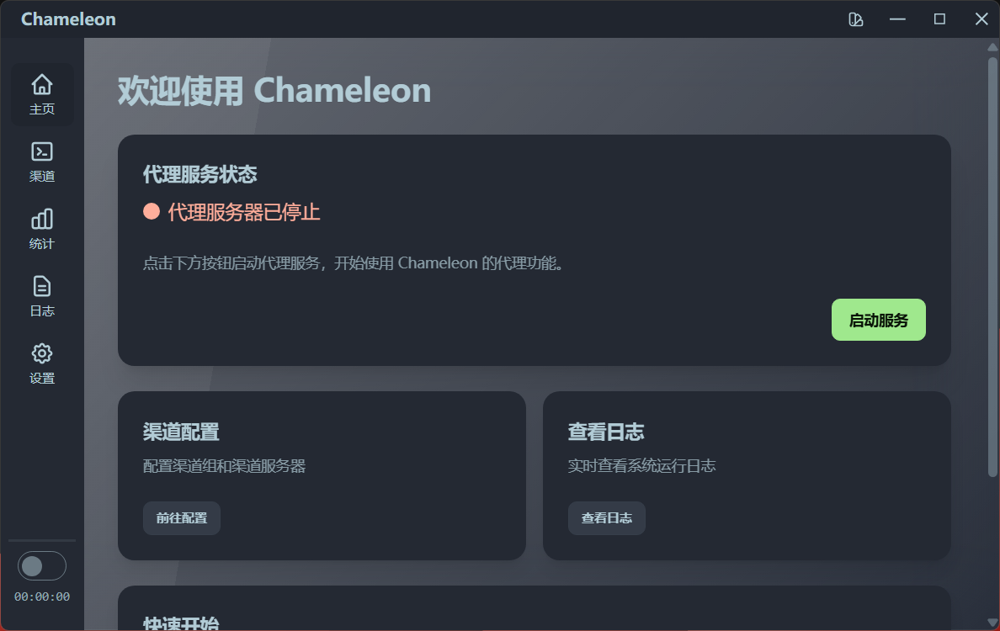
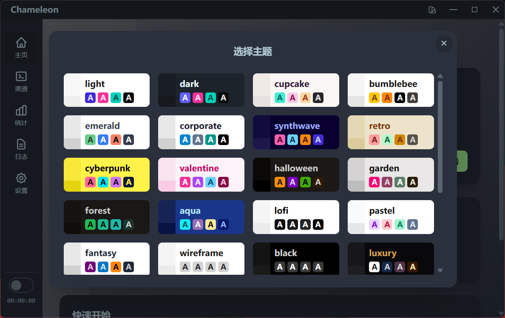
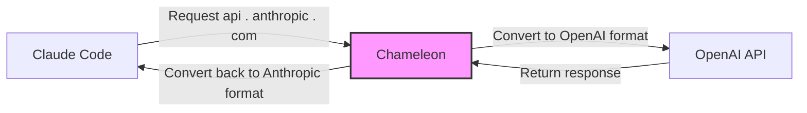
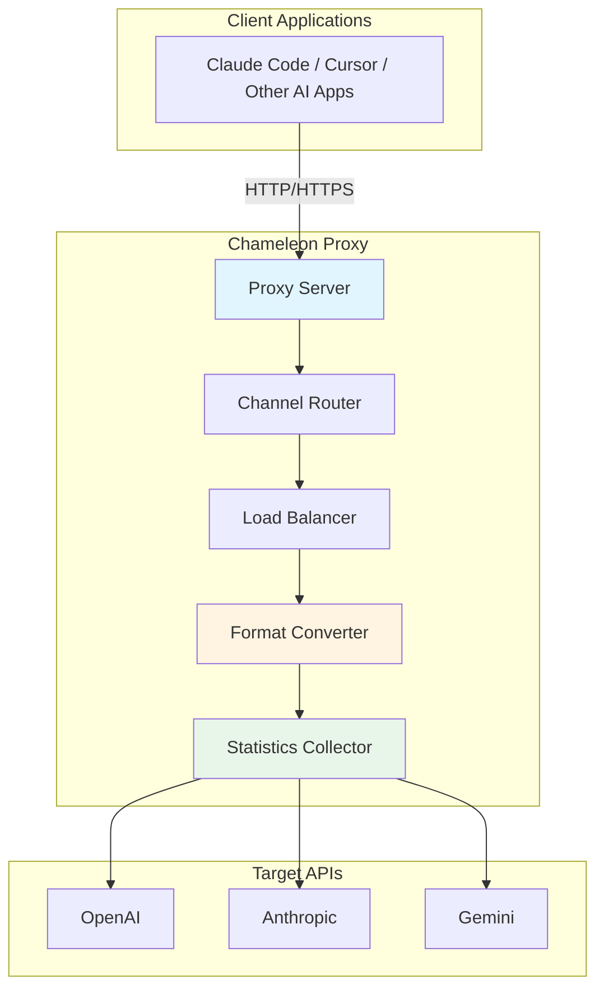
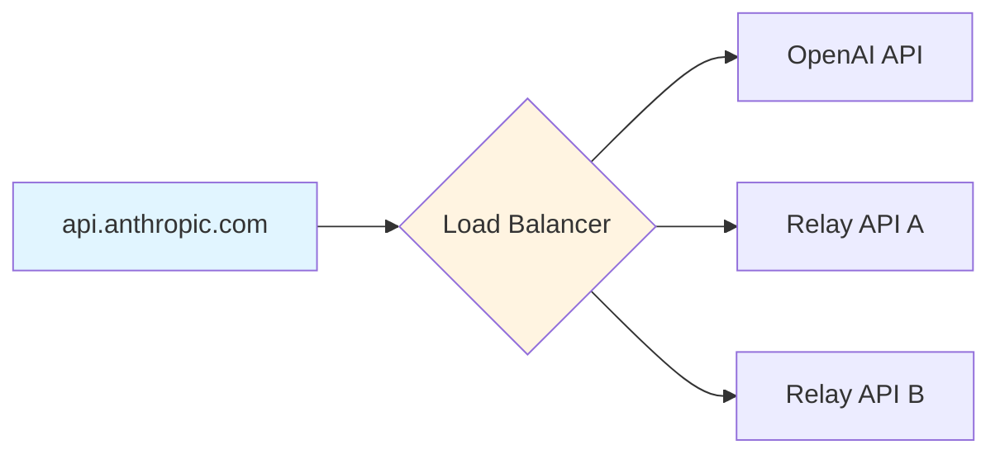
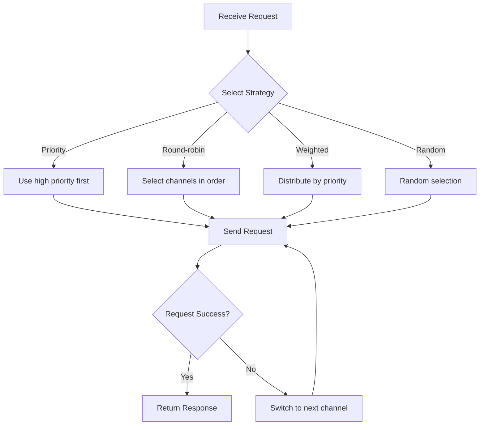

<div align="center">

# Chameleon


Local LLM API Routing Proxy Tool Based on Golang + Wails

[](https://golang.org/)
[](https://wails.io/)
[](https://vuejs.org/)
[](LICENSE)
</div>

## 📸 Screenshots

<details>
<summary>Click to view screenshots</summary>

  
  
  
  
  
  
  

</details>

## 📖 Introduction

Chameleon is a powerful LLM API proxy tool that enables API address replacement, parameter modification, format conversion, and more. Through a clean and elegant desktop interface, it provides unified proxy management for multiple AI service providers.

### Core Features

- 🔄 **Smart Format Conversion** - Support for Anthropic ↔ OpenAI, Anthropic ↔ Gemini, and other API format conversions
- 🎯 **Flexible Routing Strategies** - Round-robin, weighted round-robin, priority, random load balancing
- 🔐 **Dual Proxy Modes** - HTTP proxy mode + Host hijacking mode
- 📊 **Real-time Statistics** - Token usage, request statistics, success rate analysis
- 🎨 **Theme System** - 35+ built-in themes with clean and elegant interface design

## 🎯 Use Cases

Suppose you're using Claude Code but don't have an official Anthropic subscription, only an OpenAI API Key:



Chameleon will automatically:

1. Intercept requests from Claude Code to `api.anthropic.com`
2. Convert Anthropic format to OpenAI format
3. Forward to OpenAI API and get response
4. Convert OpenAI response back to Anthropic format
5. Return to Claude Code

## 🏗️ System Architecture



### Project Structure

```
Chameleon/
├── backend/                 # Go backend
│   ├── application/        # Main application logic
│   ├── certificate/        # HTTPS certificate management
│   ├── channel/            # Channel management and load balancing
│   ├── config/             # Configuration management
│   ├── convert/            # Format converters
│   ├── host/               # Host hijacking
│   ├── server/             # HTTP server
│   ├── statistics/         # Statistics analysis
│   └── tray/               # System tray
├── frontend/               # Vue frontend
│   └── src/
│       ├── components/     # UI components
│       │   ├── channel/   # Channel management
│       │   ├── home/      # Home page
│       │   ├── settings/  # Settings
│       │   └── stats/     # Statistics
│       └── App.vue         # Main application
├── build/                  # Build resources
└── main.go                 # Application entry
```

## 🚀 Quick Start

### Requirements

- Go 1.24+
- Node.js 18+
- Wails CLI v2.11+

### Installation

1. **Clone the repository**

```bash
git clone https://github.com/sbgayhub/chameleon.git
cd chameleon
```

2. **Install dependencies**

```bash
# Install Go dependencies
go mod download

# Install frontend dependencies
cd frontend
npm install
cd ..
```

3. **Run in development mode**

```bash
wails dev
```

4. **Build for production**

```bash
wails build
```

After building, the executable will be located in the `build/bin/` directory.

## 📚 User Guide

### 1. Choose Proxy Mode

#### HTTP Proxy Mode

- Start HTTP proxy server (default port 9527)
- Configure proxy address `http://127.0.0.1:9527` in your application
- Suitable for applications that support proxy settings

#### Host Hijacking Mode

- Automatically modify system hosts file to hijack target domain to 127.0.0.1
- Listen on port 443, no application configuration needed
- Suitable for applications that don't support proxy settings

### 2. Configure Channel Groups

A channel group represents multiple target addresses for a source API endpoint (e.g., `api.anthropic.com`):



**Configuration items:**

- **Endpoint Address** - API address to proxy (e.g., `api.anthropic.com`)
- **Provider Type** - API format type (anthropic/openai/gemini)
- **Load Balancing Strategy** - Round-robin/weighted round-robin/priority/random
- **Channel List** - Multiple target API configurations

### 3. Add Channels

Each channel contains:

- **Name** - Channel identifier
- **Target URL** - Actual API address to request
- **API Key** - Target API key
- **Provider Type** - Target API format (anthropic/openai/gemini)
- **Model Mapping** - Model name conversion rules
- **Priority** - Used for load balancing

#### Model Mapping Rules

Supports three matching modes:

```yaml
# Exact match (highest priority)
"gpt-4" = "claude-3-5-sonnet-20241022"

# Wildcard match
"gpt-3.5-*" = "claude-3-haiku-20240307"

# Full wildcard (lowest priority)
"*" = "claude-3-5-sonnet-20241022"
```

Matching order: Exact match → Wildcard match → Full wildcard → Keep original model name

### 4. Start Proxy

Click the "Start Proxy" button, and Chameleon will:

- Start the proxy server
- Apply hosts configuration (Host hijacking mode)
- Begin intercepting and forwarding requests

## 🎨 Features

### Smart Load Balancing



### Format Converters

Supported conversions (other converters in development):

| Source Format | Target Format | Converter Name       |
|---------------|---------------|----------------------|
| Anthropic     | OpenAI        | anthropic->openai    |
| Anthropic     | Anthropic     | anthropic->anthropic |
| OpenAI        | Anthropic     | openai->anthropic    |
| OpenAI        | OpenAI        | openai->openai       |

Converters automatically handle:

- Request format conversion (message structure, parameter mapping)
- Response format conversion (streaming/non-streaming)
- Model name mapping
- Token statistics

### Real-time Statistics

- **Token Usage** - Input/output token statistics
- **Request Statistics** - Success/failure counts, success rate
- **Channel Details** - Detailed statistics for each channel
- **Data Persistence** - Statistics automatically saved locally

## 🔧 Configuration Files

### Main Configuration (`data/config.toml`)

```toml
[general]
auto_start = false          # Auto-start on boot
start_minimized = false     # Start minimized
close_action = "ask"        # Close action: ask/minimize/exit

[ui]
language = "zh-CN"          # Language
theme = "light"             # Theme
width = 1200                # Window width
height = 800                # Window height

[proxy]
mode = "http"               # Proxy mode: http/host
port = 9527                 # Listen port (http mode)
cert_installed = false      # CA certificate installation status

[log]
level = "debug"             # Log level: debug/info/warn/error
file = true                 # Save to file
console = true              # Output to console
```

### Channel Configuration (`data/channels.json`)

```json
{
  "api.anthropic.com": {
    "endpoint": "api.anthropic.com",
    "enabled": true,
    "priority": 0,
    "lb_strategy": 1,
    "provider": "anthropic",
    "channels": {
      "OpenAI": {
        "name": "OpenAI",
        "enabled": true,
        "priority": 10,
        "url": "https://api.openai.com",
        "api_key": "sk-xxx",
        "provider": "openai",
        "model_mapping": {
          "*": "gpt-4"
        },
        "status": 1
      }
    }
  }
}
```

## 🛠️ Tech Stack

| Category   | Technology               |
|------------|--------------------------|
| Backend    | Go 1.24                  |
| Desktop    | Wails v2.11              |
| Web Server | net/http + http.ServeMux |
| Frontend   | Vue 3 + TypeScript       |
| UI         | DaisyUI (Tailwind CSS)   |
| Build Tool | Vite                     |
| Logging    | slog + console-slog      |
| Config     | TOML + JSON              |
| Storage    | In-memory + JSON         |


## 🔒 Security

- **Local Execution** - All data stored locally, no cloud uploads
- **Certificate Management** - Auto-generate self-signed certificates for local hijacking only
- **Minimal Permissions** - Request admin privileges only when necessary

## 🤝 Contributing

Issues and Pull Requests are welcome!

### Development Guidelines

- Use `any` instead of `interface{}` in Go code
- Use `slog` directly, don't create additional loggers
- Add necessary comments
- Follow `gofmt` formatting standards

### Commit Convention

```bash
# Feature development
git commit -m "feat: add XXX feature"

# Bug fix
git commit -m "fix: fix XXX issue"

# Documentation update
git commit -m "docs: update XXX documentation"
```

## 📄 License

This project is licensed under the MIT License - see the [LICENSE](LICENSE) file for details

## 🙏 Acknowledgments

- [Wails](https://wails.io/) - Excellent Go desktop application framework
- [DaisyUI](https://daisyui.com/) - Clean and elegant UI component library
- [Vue.js](https://vuejs.org/) - Progressive JavaScript framework

## 📮 Contact

- **Issues**: [GitHub Issues](https://github.com/sbgayhub/chameleon/issues)
- **Discussions**: [GitHub Discussions](https://github.com/sbgayhub/chameleon/discussions)

---

<div align="center">

**If this project helps you, please give it a ⭐️ Star!**

Made with ❤️ by Chameleon Team

</div>
